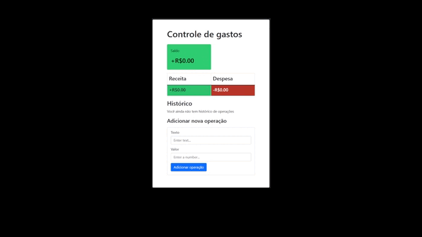

# FinancesReact

<h1>
    
</h1>

## 👉 About

Exercício de react a fim de utilizar a Context API em um modelo de aplicação para controle de gastos.

## 🛠 Stack

- 
- 
- 
- 
- 

## 💡 How to download the project

```bash

    # clone repository
    $ git clone https://github.com/pedrow42/FinancesReact

    # install dependencies
    $ npm install

    # initializing project
    $ npm run dev

```
